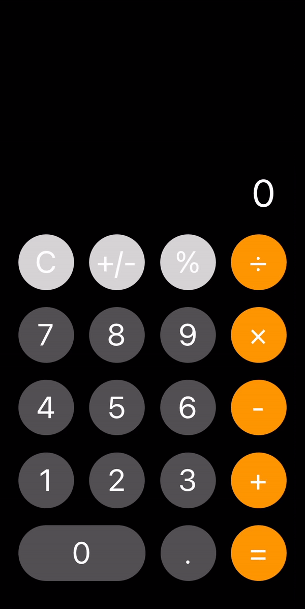

# 🧮 Calculadora Clone iOS

Bem-vindo ao repositório da Calculadora Clone iOS! 🎉 Este é um projeto criado com React Native e Expo que imita a calculadora nativa do iOS. 🚀

## 📱 Demonstração

Confira uma breve demonstração da calculadora:

</img>

## 💻 Tecnologias Utilizadas

- **React Native**: Biblioteca para construir interfaces de usuário nativas.
- **Expo**: Ferramenta para desenvolvimento e execução de projetos React Native.
- **JavaScript**: Linguagem de programação principal.

## 🛠️ Instalação

1. **Clone o repositório:**

    ```bash
    git clone https://github.com/seu-usuario/calculadora-clone-ios.git
    ```

2. **Navegue para o diretório do projeto:**

    ```bash
    cd calculadora-clone-ios
    ```

3. **Instale as dependências:**

    ```bash
    npm install
    ```

4. **Inicie o projeto com Expo:**

    ```bash
    expo start
    ```

    Isso abrirá uma nova aba no navegador com o painel do Expo, onde você pode escanear o QR code com o aplicativo Expo Go para ver o projeto em seu dispositivo móvel.

## 🎨 Funcionalidades

- Calculadora básica com operações de adição, subtração, multiplicação e divisão.
- Interface intuitiva e responsiva, imitando o design da calculadora nativa do iOS.

## 🔄 Atualizações

Este projeto está na sua primeira versão. 🚀 Estamos comprometidos em aprimorar e atualizar a aplicação regularmente. Fique atento para novas funcionalidades e melhorias!

## 📄 Licença

Este projeto está licenciado sob a [MIT License](LICENSE). Veja o arquivo `LICENSE` para mais detalhes.

---

Obrigado por visitar o projeto! 🙌
